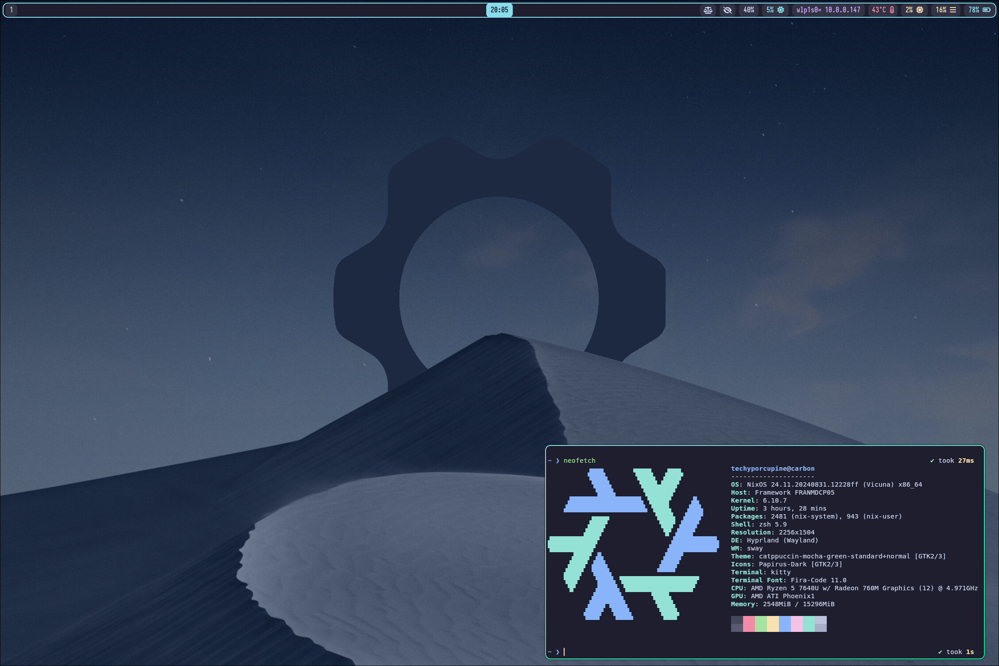

## Techyporcupine's Workstation NixOS Config

Repo that has the configuration for a nice NixOS setup using [nixos-unstable](https://github.com/NixOS/nixpkgs/tree/nixos-unstable) and [Hyprland](https://hyprland.org/).
Most of the config here is for my Framework 13 with an AMD Ryzen 5 7640U, so some things may need to be changed in your case!

## Installation

1. Make and boot an [unstable](https://channels.nixos.org/nixos-unstable) (or stable, but preferably unstable) NixOS Minimal installer USB

2. Connect to internet ([WiFi](https://nixos.org/manual/nixos/stable/#sec-installation-manual-networking) or Ethernet)

3. Install Git (we'll use nix-env as this is just an installer) `nix-env -iA nixos.gitMinimal`

4. Get this flake onto installer (use git or copy from USB drive) and then use `cd` to enter into that directory

5. Examine the configuration file for your machine, and add in proper device path for the drive you would like to install to, along with setting what size you want the swapfile in the disko configuration file (if you want a swap size other than 20GB, which should be optimal for 16GB of RAM with hibernation). Check anything with `FIXME:` and follow it's directions!

6. **!!THIS WILL ERASE YOUR DRIVE!!** Run the following command to partition disk using the disko configuration: `sudo nix --experimental-features "nix-command flakes" run github:nix-community/disko -- --mode disko disko/carbon-disko.nix`

7. Proceed to install NixOS with `sudo nixos-install --flake .#carbon`

8. After completion of install, reboot into the SSD you installed to. 

9. Log in using username and initialPassword set in configuration through GDM.

10. Change password with `passwd`

11. You should be good! All done!!

## Disk Encryption and Secure Boot

### Secure boot

Secure boot on NixOS using Lanzaboote, it's not that hard! Start by running `nix-shell -p sbctl --command "sudo sbctl create-keys"` to generate your secure boot keys! Proceed to follow the [instructions](https://github.com/nix-community/lanzaboote/blob/master/docs/QUICK_START.md#part-2-enabling-secure-boot) from Lanzaboote.

### Disk Encryption

The disko config provided by `carbon-disko.nix` includes full disk encryption that will prompt you for an encryption password when you format the drive, and using it like that will work totally fine! The fun thing is, `carbon` is also configured for automatic decryption of the drive thanks to TPM2 and `systemd-cryptenroll`. To enable automatic decryption of your drive at boot using the TPM2 chip in your device, simply run `sudo systemd-cryptenroll --tpm2-device=auto --tpm2-pcrs=0+1+4+7 /dev/nvme0n1p2  ` if you have secure boot, or run `sudo systemd-cryptenroll --tpm2-device=auto --tpm2-pcrs=0+1+4 /dev/nvme0n1p2` if you do not! It will prompt you for your drive password, and then will automatically decrypt at boot. Note, there are security implications of doing this, anyone with physical access to your computer could boot it without any user login!

## Hardware

### Carbon
Carbon is my Framework 13 with the Ryzen 5 7640U and 16GB of RAM. I daily drive this laptop on NixOS Unstable, and it probably has the second most complex config. It has full disk encryption, and at one point it had Secure Boot, but that broke so it's running without it now.

### Beryllium
Beryllium is a VM on my Proxmox VE device, and serves as the source of all my main self-hosted applications. Runs NixOS Unstable (which doesn't go well sometimes). Most services are behind Traefik with SSL certs.

### Helium
Helium is take two on a Dell Wyse 5070 thin client with a Pentium J5005 and 8GB of DDR4. It is quite overpowered for what it needs to do, but it is a Restic backup server, located off-site, recieving backups from Beryllium. It has a 1TB Toshiba external USB drive, and boots off the 16GB of internal eMMC.

### Heliumold
Was my first take on Helium, the off-site backup server using a Raspberry Pi 4, but after just a couple days the SD card got corrupted and it stopped booting, and I couldn't get it to boot from USB for the life of me, so now Helium takes over that role.